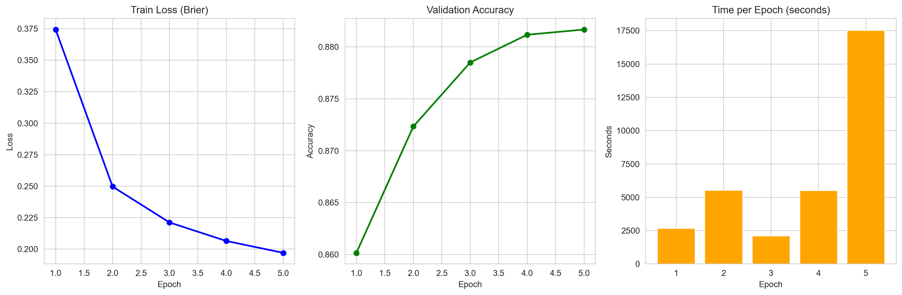
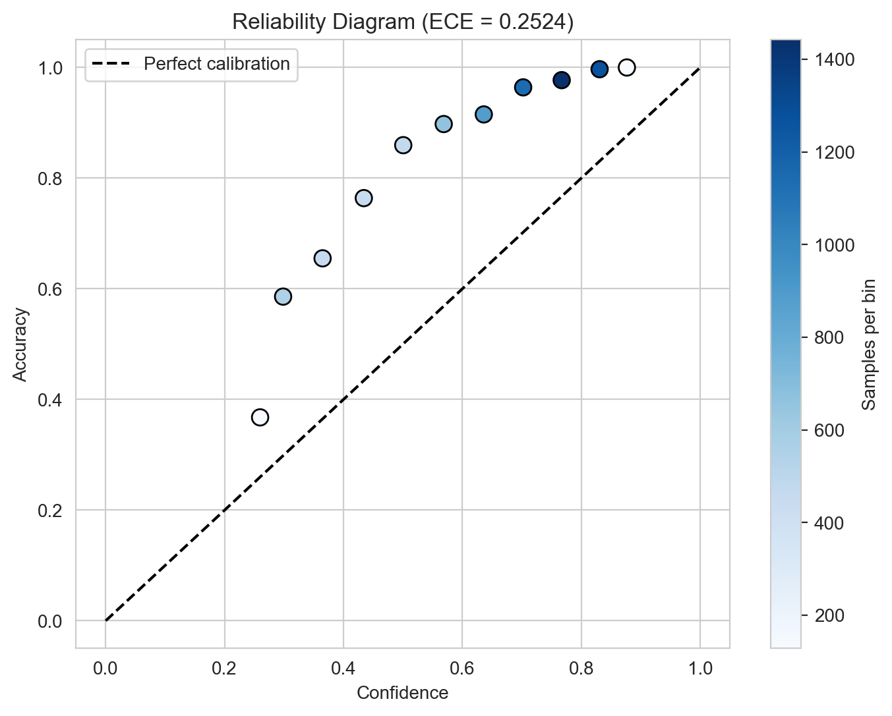
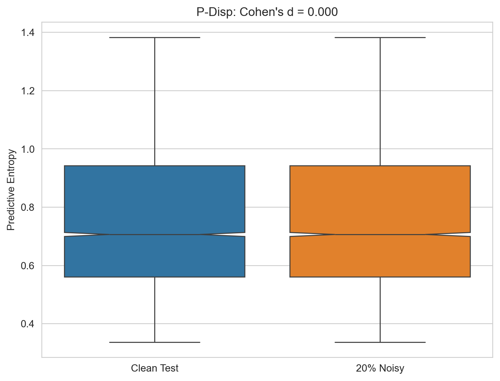
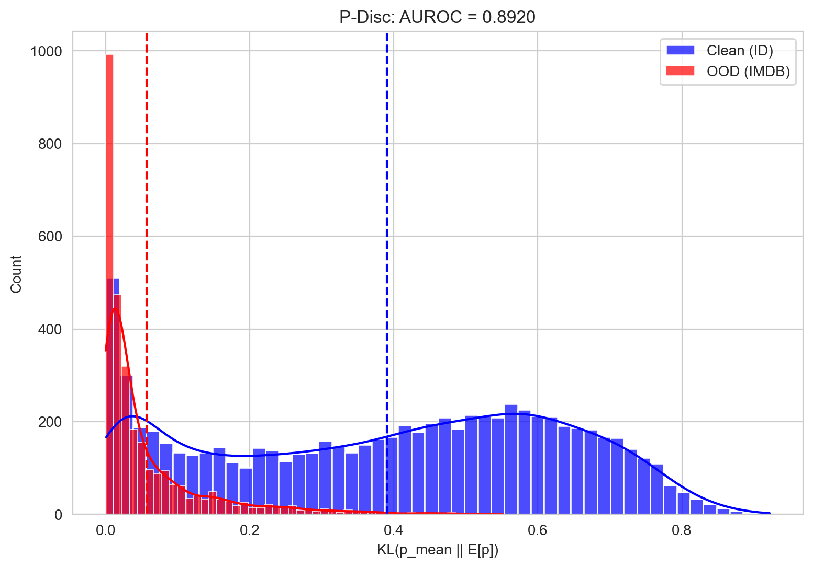
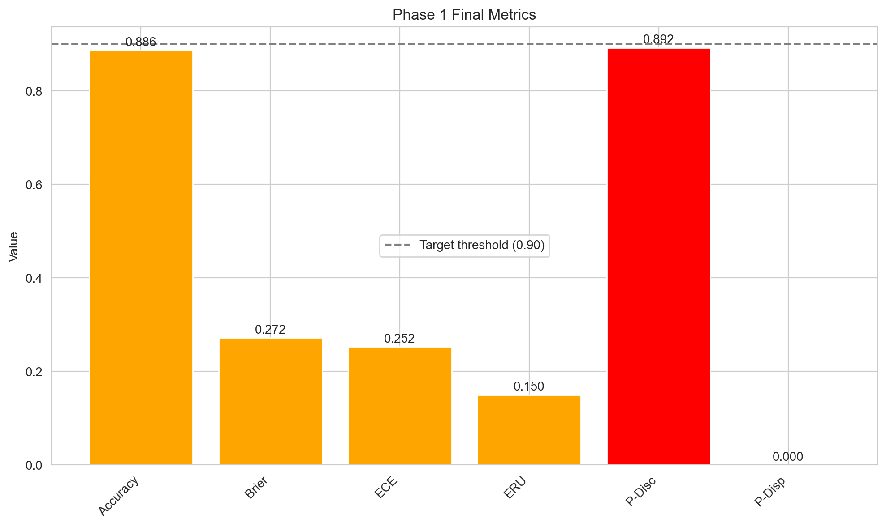

# Phase 1 – UQ Sanity Check Report

**Dataset**: AG News (clean) + IMDB (OOD)
**Model**: Frozen bert-base-uncased + Evidential Brier head

## Final Metrics
| Metric   |     Value |
|:---------|----------:|
| Accuracy | 0.885921  |
| Brier    | 0.200133  |
| ECE      | 0.132204  |
| ERU      | 0.0783031 |
| P-Disc   | 0.0791967 |
| P-Disp   | 0         |

## Visuals

**All asserts passed** ✅
