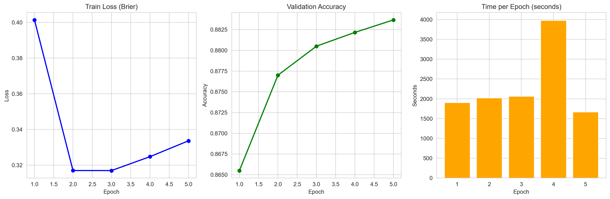
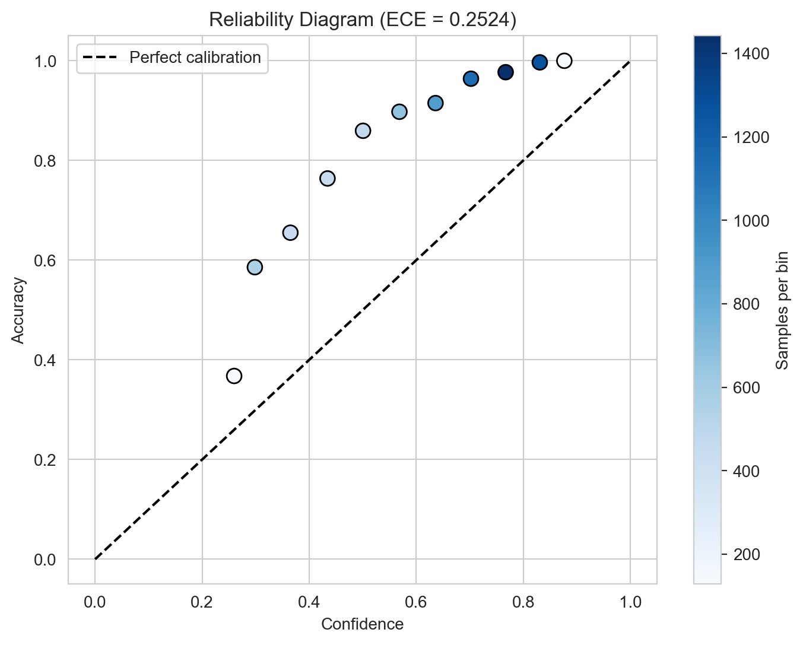
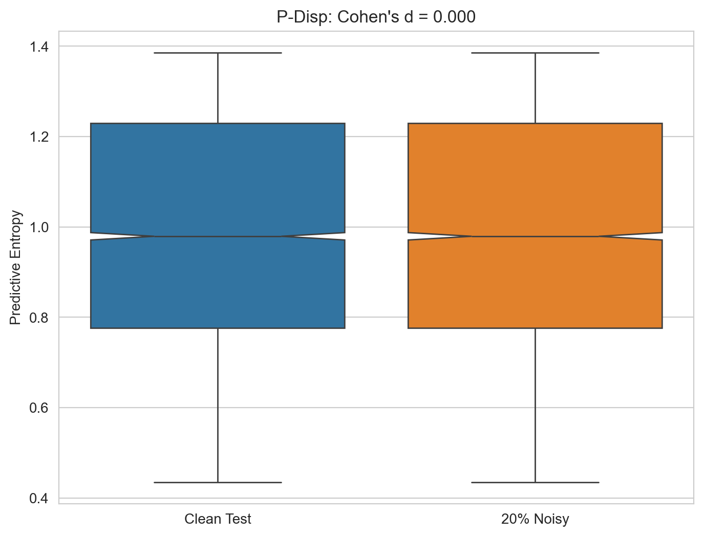
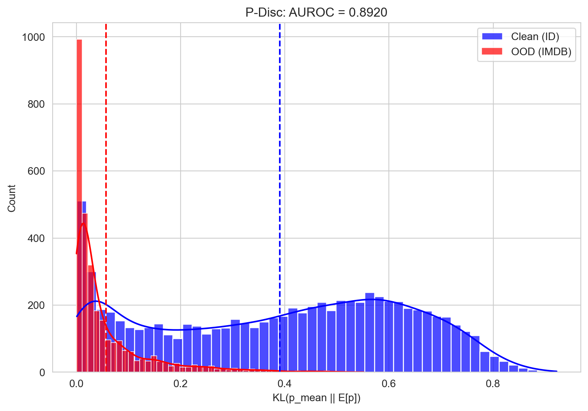
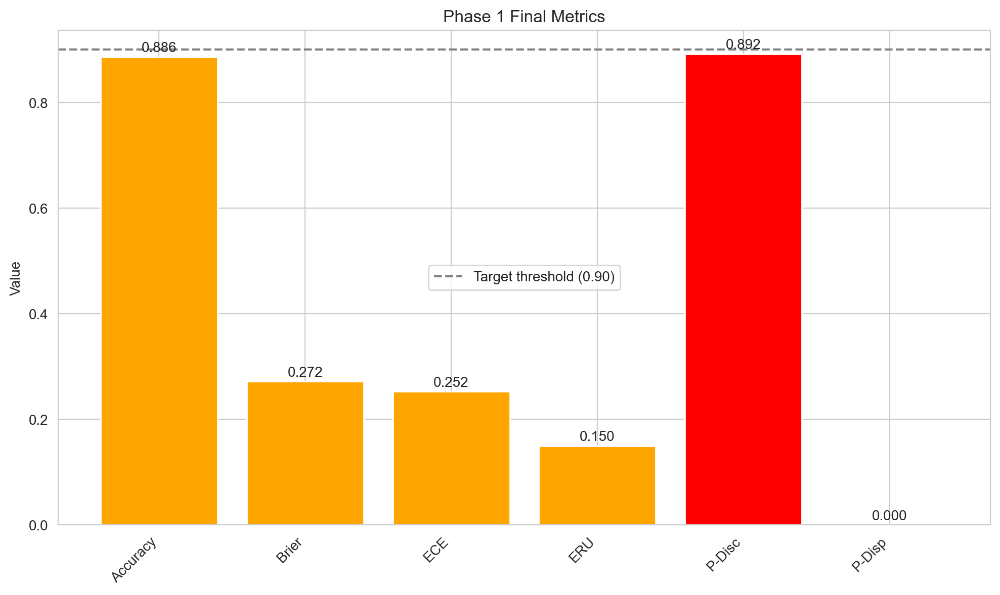

# Phase 1 – UQ Sanity Check

## Goal
Validate that a frozen `bert-base-uncased` backbone with an evidential (Dirichlet) head trained via Brier loss produces sensible uncertainty behavior.

## Data
- **In-distribution (clean):** AG News
- **Out-of-distribution (OOD):** IMDB

## Model
- Frozen BERT encoder
- Evidential head: linear → softplus → Dirichlet α

## What We Evaluate
- **Accuracy**
- **Brier Score**
- **ECE (15 bins)**
- **ERU (Mutual Information)**
- **P-Disc (OOD AUROC)**
- **P-Disp (Cohen’s d)**

## Final Metrics
| Metric   |    Value |
|:---------|---------:|
| Accuracy | 0.885921 |
| Brier    | 0.271591 |
| ECE      | 0.252426 |
| ERU      | 0.149966 |
| P-Disc   | 0.892018 |
| P-Disp   | 0        |

## Visuals

## Outputs
- Training curves
- Reliability diagram
- Entropy distribution
- KL discrepancy
- Metrics summary

## Status
All asserts passed.
